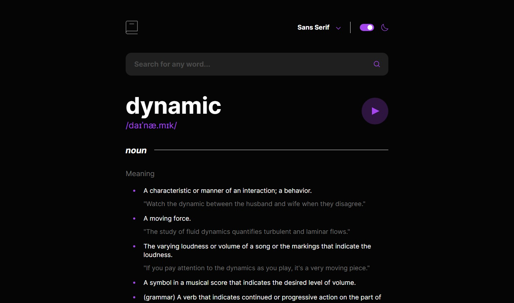

# Frontend Mentor - Dictionary web app solution

A solution provided by jefflangtech [Dictionary web app challenge on Frontend Mentor](https://www.frontendmentor.io/challenges/dictionary-web-app-h5wwnyuKFL). 

## Table of contents

- [Overview](#overview)
  - [The challenge](#the-challenge)
  - [Screenshot](#screenshot)
  - [Links](#links)
- [My process](#my-process)
  - [Built with](#built-with)
  - [What I learned](#what-i-learned)
  - [Continued development](#continued-development)
  - [Useful resources](#useful-resources)
- [Author](#author)

## Overview

### The challenge

Users should be able to:

- Search for words using the input field
- See the Free Dictionary API's response for the searched word
- See a form validation message when trying to submit a blank form
- Play the audio file for a word when it's available
- Switch between serif, sans serif, and monospace fonts
- Switch between light and dark themes
- View the optimal layout for the interface depending on their device's screen size
- See hover and focus states for all interactive elements on the page
- Have the correct color scheme chosen for them based on their computer preferences. 

### Screenshot

### Links

- Solution URL: [Frontend Mentor Solution](https://your-solution-url.com)
- Live Site URL: [JeffLangTech Github Repo](https://jefflangtech.github.io/dictionary-web-app/index.html)

## My process

### Built with

- Semantic HTML5 markup
- CSS custom properties
- Lots of vanilla JS

### What I learned

I went quite deep with this one without using a JS library or framework to help. I think it certainly would have been much faster and cleaner to *not* do it the way I did, but I certainly learned a lot along the way. Here's the summary:

- How to create a single page application
- How to work with the browser history, url, and search queries
- How to set up a light/dark mode and make it work
- How to set up font systems and switch between them
- Kinda sorta set up an MCV (model-controller-view) architecture but I would say the implementation was a failure and I would need to rebuild the entire thing from scratch to correctly do it--now that I have a better idea how
- Dynamically create content for the page. I would also do this much differently next time because the current app causes the browser to update/repaint too often and this would be terrible if the app was of any significant weight
- Working with closures and IIFE's

### Continued development

I just wrote way, way too much code, both in terms of CSS and JS. For JavaScript, in addition to getting better with various coding patterns and how to work with them, I just hope to write cleaner, more concise, better organized code.

For CSS I'm really going back to some basics, and basic designs from Frontend Mentor, so that I can work on trimming down the excess.

### Useful resources

Again, learning so much using ChatGPT, and testing out Bard as well, to investigate the problems I need to solve and explore potential solutions. I don't usually use these to write any code but instead to help me learn how things work so that I can write the code. Believe me, at this point, I think ChatGPT would have written much better code than what I came up with. I am glad that it is all functional, however, and what I wanted to achieve I was able to do so.

## Author

- Website - [JeffLangTech](https://jefflangtech.github.io/)
- Frontend Mentor - [@jefflangtech](https://www.frontendmentor.io/profile/jefflangtech)
